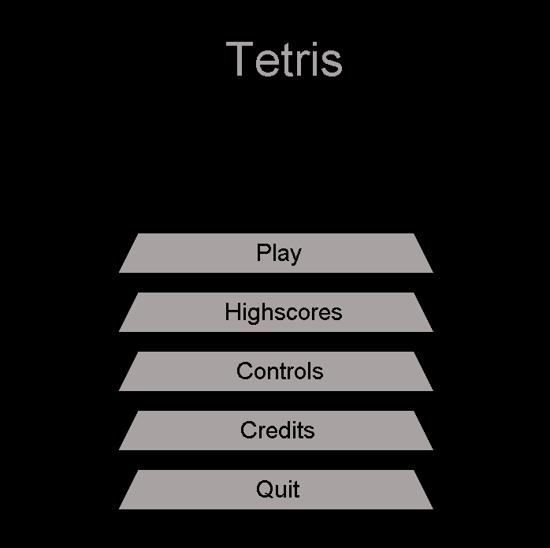
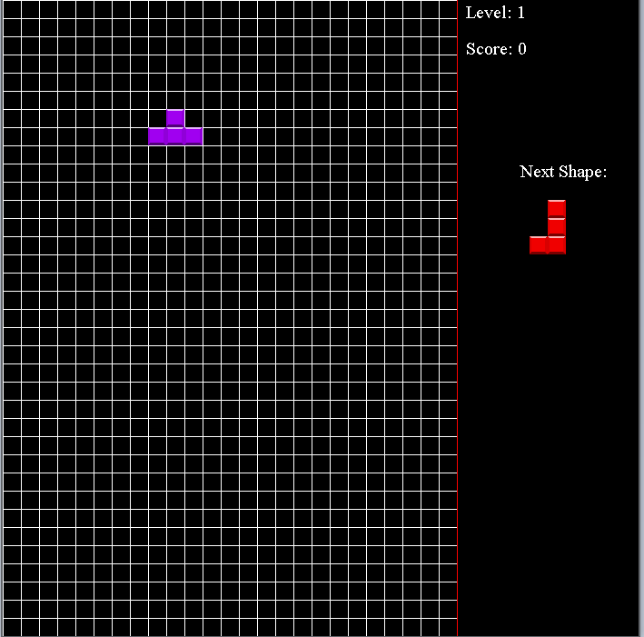
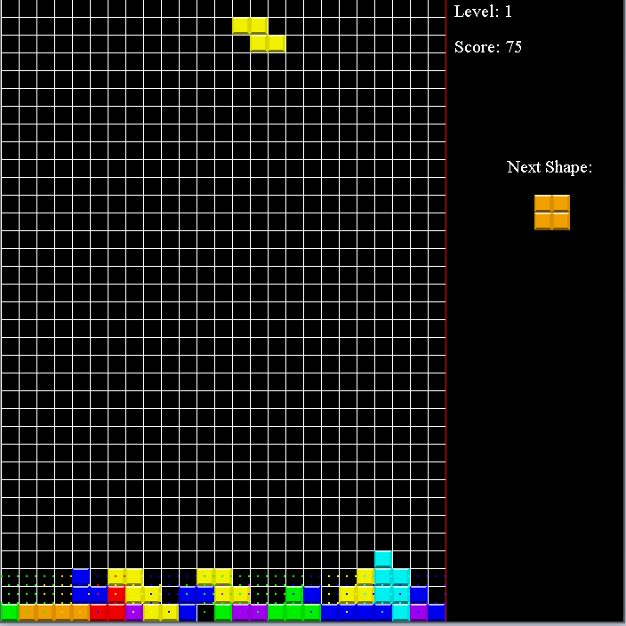

# Tetris
Remake of the classic Tetris game.

##Summary
This remake features a different graphics style, a destruction effect for when an entire row is filled and features added sounds and music in addition to a highscore list. Since each block is an image, matrix transformations were used to rotate each block easily in code.

##Controls
**P:** pause the game
**Left/Right Arrow Keys:** Move shape left and right
**Up Arrow Key:** Rotate Shape
**Down Arrow Key:** Accelerate Shape Down

##Screenshots

 
*Main Menu*

 
*Main Game Screen*

 
*Row Destruction Effect*
